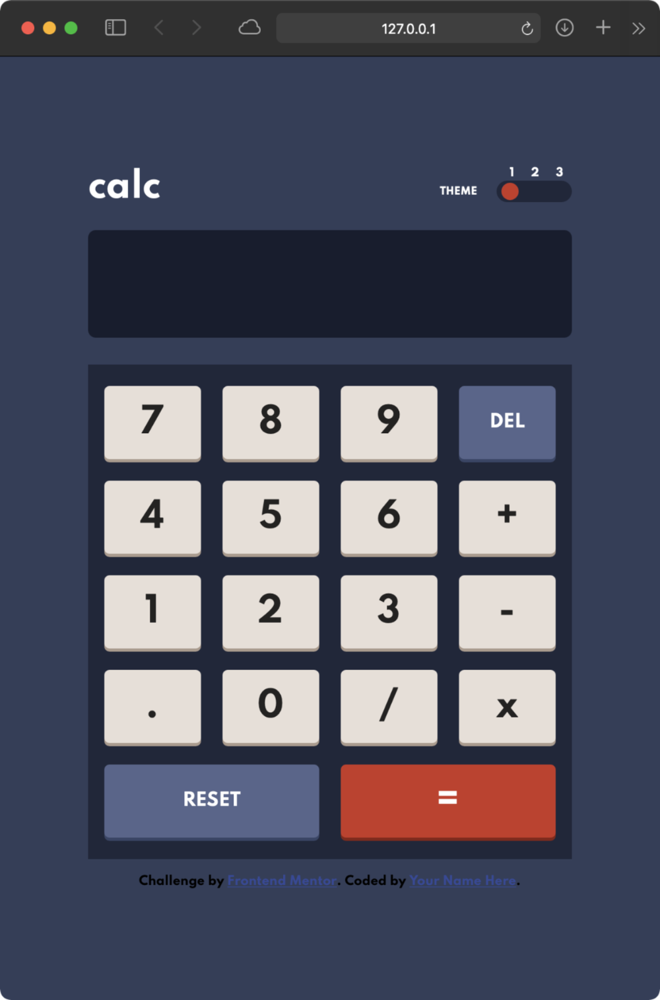

# Frontend Mentor - Calculator app solution

This is a solution to the [Calculator app challenge on Frontend Mentor](https://www.frontendmentor.io/challenges/calculator-app-9lteq5N29). Frontend Mentor challenges help you improve your coding skills by building realistic projects.

## Table of contents

- [Overview](#overview)
  - [The challenge](#the-challenge)
  - [Screenshot](#screenshot)
  - [Links](#links)
- [My process](#my-process)
  - [Built with](#built-with)
  - [What I learned](#what-i-learned)
- [Author](#author)

## Overview

### The challenge

Users should be able to:

- See the size of the elements adjust based on their device's screen size
- Perform mathematical operations like addition, subtraction, multiplication, and division
- Adjust the color theme based on their preference
- **Bonus**: Have their initial theme preference checked using `prefers-color-scheme` and have any additional changes saved in the browser

### Screenshot

### Links

- Solution URL: [Git](https://github.com/davidbdeath/calculator-app-main)
- Live Site URL: [Calculator](https://davidbdeath.github.io/calculator-app-main/)

## My process
I started by planning out how to do the theme switcher first, then put everything into the **HTML** and styled it with **CSS**.
Then I figured out how to use **Javascript** to check `prefers-color-scheme` and change themes by switching an alternative stylesheet.
The alternative style sheets only contained color data in the form of **CSS variables**.
Then I used **javascript** to disable double tap zoom, perform input verification and swap * for x on the screen.

### Built with

- Semantic HTML5 markup
- CSS custom properties
- Flexbox
- Javascript

### What I learned

I learned how to style radial buttons and theme switch using javascript.

## Author

- Website - [David Dyer](https://daviddyer.me)
- Frontend Mentor - [@davidbdeath](https://www.frontendmentor.io/profile/davidbdeath)

# calculator-app-main
